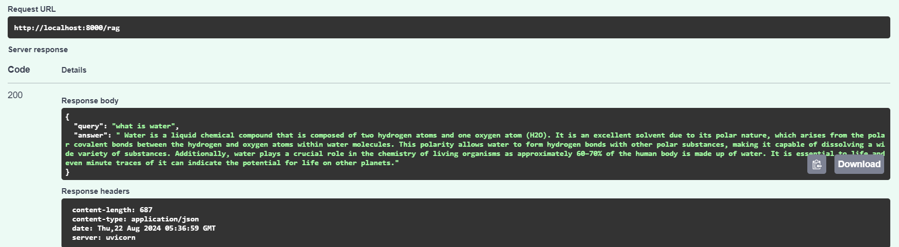

# RAG-based Q&A API with FastAPI

This project provides a Retrieval-Augmented Generation (RAG) based Q&A API using FastAPI, where users can input a query and receive an AI-generated response based on [PDF](https://assets.openstax.org/oscms-prodcms/media/documents/ConceptsofBiology-WEB.pdf).

## Prerequisites

Make sure you have the following installed on your system:

- **Docker**: [Install Docker](https://docs.docker.com/get-docker/)
- **Docker Compose**: [Install Docker Compose](https://docs.docker.com/compose/install/)

## Getting Started

Follow the steps below to build and run the application using Docker:

### spinning  up the container

to create the image and container up and running:

```bash
docker compose up
```

### go to fast api swagger
go to locahost:8000/docs

hit the /rag endpoint with the query



## Technical Explanation
The app.py file is the core of this application, implementing the Retrieval-Augmented Generation (RAG) based Q&A API using FastAPI. Below is a breakdown of its components and their functionality:

1. Importing Dependencies
* FastAPI: A modern, fast web framework for building APIs with Python.
* Requests and PyMuPDF: Used for downloading and extracting text from the PDF.
* Pydantic: Used for data validation, ensuring the correct structure of incoming requests.
* spaCy: A library for advanced natural language processing (NLP), used to tokenize the extracted text.
* Sentence Transformers: Provides a pre-trained model to create sentence embeddings.
* FAISS: A library for efficient similarity search, used for retrieving relevant passages.
* Hugging Face Hub: To interact with the LLM for generating responses.

2. PDF Download and Text Extraction
The app downloads a PDF document from a given URL using the requests library.
PyMuPDF (fitz) is used to extract text from the first 100 pages of the PDF.
The extracted text is then cleaned and prepared for further processing.
3. Sentence Tokenization
The text is processed using spaCy to split it into sentences.
Each sentence is treated as an individual passage for further embedding and retrieval operations.
4. Embedding Generation
The SentenceTransformer model (all-MiniLM-L6-v2) is used to convert the sentences into vector embeddings.
These embeddings are then stored in a FAISS index, enabling efficient similarity search.
5. FAISS Index
FAISS (Facebook AI Similarity Search) is initialized with the generated embeddings.
The FAISS index allows quick retrieval of the most relevant passages based on the similarity to a query.
6. LLM Integration
The Hugging Face InferenceClient is initialized to interact with the Mistral-7B-Instruct model.
This model generates answers based on the retrieved context from the FAISS index.
7. API Endpoints
/rag (POST): The main endpoint that accepts a query in JSON format. The query is embedded, and relevant sentences are retrieved from the FAISS index. The retrieved sentences are used as context to generate an answer from the LLM.
/ (GET): A simple root endpoint to verify that the API is running.
8. Query Handling
The application takes a user query, embeds it using the same SentenceTransformer model, and searches the FAISS index for similar sentences.
The top matching sentences are concatenated to form a context, which is then sent to the LLM.
The LLM generates a response based on this context, which is returned as the answer to the query.

